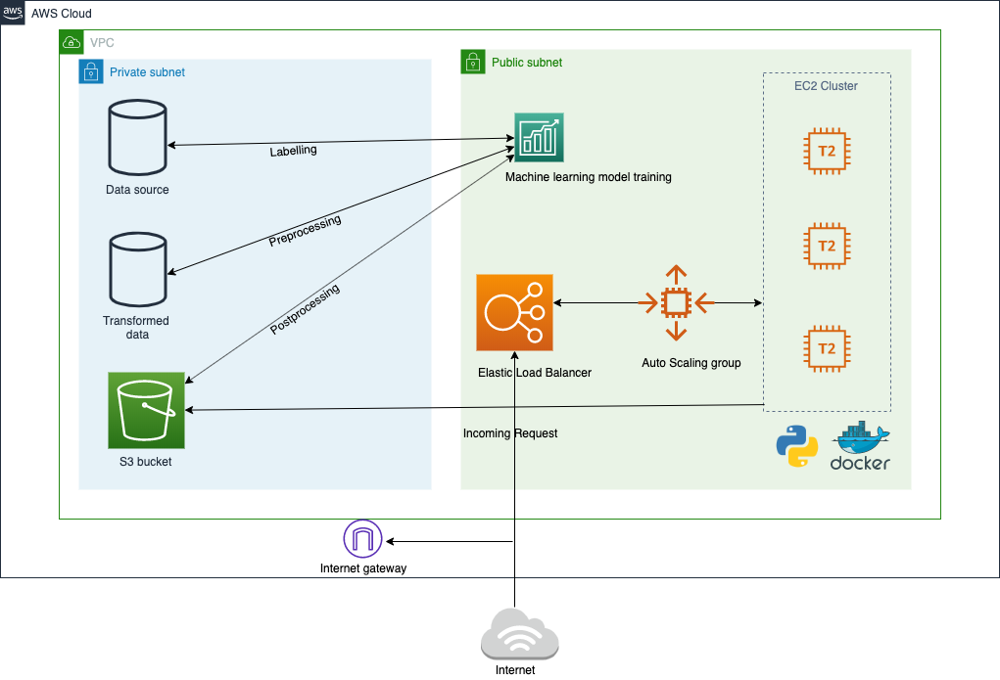

# WhomToVote

Team Members:
1. Prachal Jitendrakumar Patel
2. Priyam Vaidya
3. Jay Pathak
4. Ashwini Ulhas Talele

**WhomToVote?**

Description: By using the dataset of US Presendental election, a system can analyze voting patterns, change in the economy, employement rate , per capita income growth rate, and various other parameters to determine the data of the voters and predict the results based on the current data.

Goal: This system can help citizen to get the information of voting demographic of a political party.This way they can know which party could win the election using latest data.

<h3>Abstract: </h3>
For any country, the government holds an important role for comprehensive development which is expected by the citizens. Based on this system, the political party can get an idea about demographic of their average voters. Using which, the party can take proper actions and plan their campaign accordingly. Apart from this, they get the basic idea what they need to improve. As a citizen, you can get information of various factors like employment rate, per capita income, literact rate of each political party, and cast your vote to the party who works on things which you want to improve. Looking at the category wise graphical view, user can decide whom to vote

<h3>Architecture Diagram</h3>

<h3>Design Thinking</h3>

<h2>Personas and Hill Statement</h2>

<b>1. Voter: Voter can view the results based on economic growth in a particular period and vote for upcoming elections.</b>
  
 <li> Who? Voter</li>
  <li>What? Can view voting data  </li>
  <li>How? in the form of graphs</li>
   
<b>2. Political Party: A political party can view prediction and plan their campaign accordingly.</b>
   
  <li>Who? Political Party</li>
  <li>What? Can view voting data to look at thier progress</li>
  <li>How? by looking at the predictions</li>
  
 
 

  
**Technology stack: 
 Datasets: Opendata
 Language: Python, Javascript,React
 Infrastructure: Docker, AWS
 Visualisation: Chart.js
Domain: Machine Learning**

